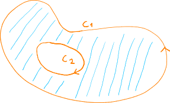

# Teorema de Green. Fluxos. Teorema da Divergência.

```toc

```

## Bordo de um Domínio

Seja $D \subset \R^2$ um conjunto aberto e limitado.

Então, **$\partial D$ é o bordo de $D$** (pode-se ver como sendo equivalente à fronteira).

Podemos também definir a {orange}(orientação canónica de $\partial D$): é a orientação que deixa o conjunto do lado esquerdo da curva.



## Teorema de Green

:::tip[TEOREMA]

Se $F = (P, Q)$, $F: \R^2 \to \R^2$ e é de classe $C^1$.

Então, considerando $\partial D$ com a orientação canónica,

$$
\oint_{\partial D} F \d g = \oint_{\partial D} P \d x + Q \d y = \iint_{D} \left(\frac{\partial Q}{\partial x}- \frac{\partial P}{\partial y} \right) \d x \d y
$$

:::

Se $F: D \subset \R^2 \to \R^2$, $F=(P,Q)$, $C^1$ for fechado, isto é, $\frac{\partial P}{\partial y} = \frac{\partial Q}{\partial x}$,
então sabemos que:

$$
\oint_{\partial D} F = \iint_D \left( \frac{\partial Q}{\partial x}- \frac{\partial P}{\partial y} \right) \d x \d y = 0
$$

Assim, {green}(**um campo fechado é conservativo nas curvas que delimitam regiões onde $F$ esteja definido.**)

**NOTA:** Sentido Direto = Sentido Positivo = Sentido Anti-Horário

:::details[Exemplos]

**Sejam $F$ e a circunferência $C$, $x^2+y^2=10$, orientada no sentido horário.**

$$
F(x,y) = \left(-\frac{1}{3} y^3, \frac{1}{3}x^3 \right)
$$

**Determine $\oint_C F$.**

Como $C = \partial D$ mas com a orientação contrária à canónica, temos que
$\oint_C F \d g = - \oint_{\partial D} F \d g$

$$
\begin{aligned}
\oint_{\partial D} F \d g &= \iint_D \left(x^2-\left(-y^2 \right) \right) \d x \d y\\
&= \int^{2\pi}_0 \int^{\sqrt{10}}_0 r^2 \cdot r \d r \d \theta\\
&= \int^{2\pi}_0 \left[\frac{r^4}{4} \right]^{\sqrt{10}}_0 \d \theta\\
&= 50 \pi
\end{aligned}
$$

Então,

$$
\oint_C F \d g = -50 \pi
$$

---

**Qual o valor de**

$$
\int_{\partial D} (e^{x^2} - 3y, \arctan y + x) \d \vec g
$$

**sabendo que $\partial D$ é a fronteira do quadrado $[-1, 1] \times [-1, 1]$ percorrida no sentido direto?**

**NOTA:** Sentido direto = Sentido Positivo = Sentido Anti-Horário

Será que $F$ é fechado?

$$
\begin{darray}{ll}
\frac{\partial F_1}{\partial y} = -3 & \frac{\partial F_2}{\partial x} = 1
\end{darray}
$$

Como são diferentes, não, $F$ não é fechado.

Então, pelos Teorema de Green:

$$
\begin{aligned}
\int_{\partial D} (e^x-3y, \arctan y + x) \d \vec g & = \iint _D 1 - (-3) \d x \d y\\
&= 4 \text{Área}(D)\\
&= 4\times 4 = 16
\end{aligned}
$$

visto que $D$ é um quadrado de área $4$.

---

**Considerando o campo vetorial $F$:**

$$
\begin{darray}{ll}
F(x,y) = \left(\frac{x}{x^2+y^2}, \frac{y}{x^2+y^2} \right)
& F: \R^2 \backslash \{(0,0)\} \to \R^2
\end{darray}
$$

1. **Será que $F$ é fechado?**

$$
\frac{\partial}{\partial x} \left(\frac{y}{x^2 + y^2} \right) = \frac{-y\cdot (2x)}{(x^2+y^2)^2} = \frac{-2xy}{(x^2+y^2)^2}
$$

$$
\frac{\partial}{\partial y} \left(\frac{x}{x^2 + y^2} \right) = \frac{-x\cdot (2y)}{(x^2+y^2)^2} = \frac{-2xy}{(x^2+y^2)^2}
$$

Sim, $F$ é fechado.

2. **Será que $F$ é gradiente?**
   Por outras palavras, será que existe um $\phi$ tal que $\nabla \phi = F$?

Como o domínio não é simplesmente conexo, nada podemos saber sobre a $F$ ser gradiente.

$$
\begin{cases}
\frac{\partial \phi}{\partial x} = \frac{x}{x^2+y^2}\\
\frac{\partial \phi}{\partial y} = \frac{y}{x^2+y^2}
\end{cases}
\Leftrightarrow
\begin{cases}
\phi(x,y) = \frac{1}{2} \log(x^2+y^2) + C_1(y)\\
\phi(x,y) = \frac{1}{2} \log(x^2+y^2) + C_2(x)
\end{cases}
$$

Escolhendo $C_1 = C_2 = 0$, $\phi = \frac{1}{2} \log(x^2+y^2)$ é um potencial de $F$.

Logo, $F$ é gradiente.

3. **Calcule o trabalho de $F$ em C, quando percorrida no sentido dos $yy$ decrescentes,**

   $$
   C = \{(x,y) \in \R^2 : x = \frac{(1+y)^4}{2} , 0 \leq y \leq 1 \}
   $$

Como $F$ é gradiente:

- Ponto inicial: $A = (8,1)$
- Ponto final: $B = \left(\frac{1}{2}, 0\right)$

$$
\int_C F \d \vec g = \phi (B) - \phi (A) = \frac{1}{2} \log \left(\frac{1}{4}\right) - \frac{1}{2} \log \left(64 + 1\right)
$$

:::

## Domínio Simplesmente Conexo

:::tip[DEFINIÇÃO]

Um domínio D é simplesmente conexo se qualquer curva em $D$ for [homotópica](#homotopia) a um ponto.

:::

### Homotopia

Dadas duas curvas $C_1$ e $C_2$ num domínio $D$ dizemos que $C_1$ e $C_2$ são homotópicas
se for possível deformar $C_1$ e chegar a $C_2$ sem sair de $D$.


## Relação entre Curvas Homotópicas

Sejam duas curvas [**homotópicas**](#homotopia) que têm a mesma orientação e
um campo vetorial fechado $F: D \to \R^2$.  
Então:

$$
\int_{C_1} F \cdot \d \vec g = \int_{C_2} F \cdot \d \vec g
$$

:::details[Exemplo]

**Considere-se o campo vetorial $F$:**

$$
F(x,y) = \left(- \frac{y-1}{x^2+(y-1)^2}, \frac{x}{x^2+(y-1)^2}\right)
$$

**Seja $C$ a fronteira do quadrado de vértices $(3,0)$, $(0,3)$, $(-3,0)$ e $(0,-3)$ percorrida no sentido anti-horário.**  
**Qual o valor de $\int_C F \d \vec g$?**

Sabemos que $F$ corresponde a um [vórtice](./0016-campos-vetoriais.md#vortice) centrado em $(0,1)$ e que $F: \R^2 \backslash \{(0,1)\}$.  
Como tal, $F$ é fechado, mas não é gradiente.

Assim, se considerarmos uma curva $C_2$ homotópica a $C$, sabemos que
$\int_C F \d \vec g = \int_{C_2} F \d \vec g$.

Visto que $F$ é um vórtice, pode-se simplificar os cálculos escolhendo uma cirfunferência de raio $1$ centrada em $(0,1)$.


Parametrizando $C_2$:

$$
\begin{array}{ll}
\begin{cases}
x = \cos t\\
y = \sin t + 1
\end{cases}
&
\begin{aligned}
g(t) &= (\cos t, \sin t + 1)\\
g'(t) &= (-\sin t, \cos t)
\end{aligned}
\end{array}
$$

E finalmente calculando o integral ao longo de $C_2$:

$$
F(x,y) = \left(- \frac{y-1}{x^2 + (y-1)^2}, \frac{x}{x^2+(y-1)^2}\right)
$$

$$
F(g(t)) = \left(-\frac{\sin t}{1}, \frac{\cos t}{1}\right) = (-\sin t, \cos t)
$$

$$
\begin{aligned}
\int_C F \d \vec g = \int_{C_2} F \d \vec g &= \int^{2\pi}_0 (-\sin t, \cos t) \cdot (-\sin t, \cos t) \d t\\
&= \int^{2\pi}_0 1 \d t = 2 \pi
\end{aligned}
$$

:::

---

Slides:

- [Aula 42](https://drive.google.com/file/d/1Rh4CgKjNlN0dsOW1Tj7hx2Vsi_tE3iX5/view?usp=sharing)
- [Aula 43](https://drive.google.com/file/d/1jSrsIL09bUATiovHIA4RHd41K3aS4fpL/view?usp=sharing)
- [Aula 44](https://drive.google.com/file/d/1nBL6e79aEpJiLx_uZcdqRc9M5IIVFzVu/view?usp=sharing)
