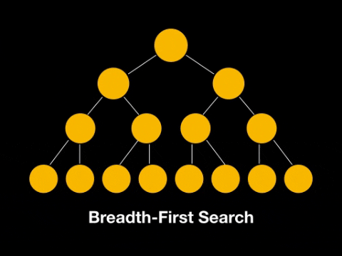
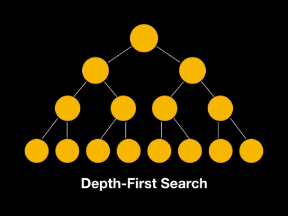

# Grafos

```toc

```

## Definição e Representação


- Constituído por um conjunto V de vértices (nós) e E de arcos (arestas).
  - Arco liga 2 vértices
  - Vértice pode estar ligado a qualquer número de outros vértices

### Grafo de um Node


- O grau de 1 vértice (d,degree) contabiliza o números de ligações de 1 vértice

- O grau médio de um grafo (z), é a média dos graus de todos os vértices

### Alguns Tipos de Grafos

#### Grafo orientado

- As suas arestas têm direções (->)


#### Grafo Pesado

- As arestas têm valores


#### Grafo Acíclicos Orientados

- Para qualquer vértice v, não há nenhum caminho começando e acabando em v.


#### Grafo Conexo

- Para quaisqueres vértices v e u, há sempre o caminho a ligar u e v.


#### Grafo Bi-conectado

- Para qualquer vértice v, se removemos v, o grafo continua conexo.


## Representação


### Lista de Adjacências

Cada nó mostra os nós com que faz aresta.


#### Vantagens

- Inicialização é proporcional a $V$

- Utiliza sempre espaço proporcional a $V+E$
  - Adequado para grafos esparsos
  - Algoritmos que assentem na análise de arcos em grafos esparsos.
- Adição de arcos é feita de forma eficiente

#### Desvantagens

- Arcos paralelos e adjacência entre vértices
  - Requer que se pesquise as listas de adjacências, o que pode levar
    um tempo proporcional a $V$
- Remoção de arcos
  - Pode levar um tempo proporcional a $V$ (este problema pode ser
    contornado).
- Não aconselhável para
  - Grafos de grande dimensão que não podem ter arcos paralelos
  - Grande utilização de remoção de arcos

### Matriz de Adjacências

Matriz que apenas é constituída por (0 e 1), onde 1 simboliza existir uma aresta entre a coluna e a linha.


#### Vantagens

- Representação mais adequada quando:

  - Há espaço disponível
  - Grafos são densos
  - Algoritmos requerem mais de $V^2$ operações

- Adição e remoção de arcos é feita de forma eficiente

- Fácil evitar existência de arcos paralelos (repetidos)

- Fácil determinar se 2 vértices estão ou não ligados

#### Desvantagens

- Grafos esparsos de grande dimensão requerem espaço de memória proporcional a $V^2$

- Neste caso, a simples inicialização do grafo
  (proporcional a $V^2$) pode dominar o tempo de execução
  global do algoritmo

- Para o caso de grafos muito esparsos, mas com um
  número muito elevado de vértices, pode nem sequer
  existir memória suficiente para armazenar a matriz

### Representações Alternativas

- 3 mecanismos básicos de representação de grafos

  - Vector de arcos (pouco comum)
  - Matriz de adjacências
  - Lista de adjacências

- Produzem diferentes desempenhos ao nível das operações de manipulação

- Escolha deverá depender do problema a resolver

$$
\begin{array}{ c| c| c |c }
Desempenho & Vetor\ de\ arcos & Matriz\ de\ Adj. & Listas\ de\ Adj.\\
\hline
Espaço & O( E) & O\left( V^{2}\right) & O( V+E)\\
Inicialização & O( 1) & O\left( V^{2}\right) & O( V)\\
Cópia & O( E) & O\left( V^{2}\right) & O( E)\\
Destruição & O( 1) & O( V) & O( E)\\
Inserir\ Arco & O( 1) & O( 1) & O( V)\\
Encontrar\ Arco & O( E) & O( 1) & O( V)\\
Remover\ Arco & O( E) & O( 1) & O( V)
\end{array}
$$

$V$ - vértices (nós)\
$E$ - arcos (arestas).

A Implementação do código encontra-se nos slides.

## Algoritmos de Exploração/Procura em Grafos

- Quero saber todas as páginas da WWW. (web crawling)

- Quero encontrar os meus amigos no facebook (se os tiver)
  ::: details Exemplo
  amigos dos amigos,\
  amigos dos amigos do amigos,\
  amigos dos amigos dos amigos do amigos,\
  amigos dos amigos dos amigos dos amigos do amigos,\
  amigos dos amigos dos amigos dos amigos dos amigos do amigos,\
  amigos dos amigos dos amigos dos amigos dos amigos dos amigos do amigos,\
  amigos dos amigos dos amigos dos amigos do amigos,\
  amigos dos amigos dos amigos do amigos,\
  amigos dos amigos do amigos,\
  amigos dos amigos,

  

  :::

- Propargar mensagens numa rede

- AI, puzzles e labirintos

### Algoritmos de Procura em Grafos

::: tip Exemplos
Para ambos os algoritmos aconselho a ver os exemplos nos slides
:::


- Dado um vértice origem/fonte

- Visitar todos os vértices atingíveis a partir da origem

  - Todos os vértices que estão em qualquer caminho do grafo que comece na origem

- A ordem pela qual os vértices são visitados depende do tipo de procura

- Procurar em grafos é equivalente a percorrer labirintos

  - Necessário marcar pontos já visitados
  - Ser-se capaz de recuar, num caminho efectuado, até ao ponto de partida

- Os vários algoritmos de procura em grafos limitam-se a executar uma determinada estratégia de procura em labirintos
  - Procura em profundidade primeiro (DFS - "Depth-first-search")
  - Admite 2 implementações: recursiva e com uso de pilha explícita
  - Substituindo a pilha por um FIFO,\
    transforma-se em Procura em largura primeiro (BFS - 'Breadth-first-search')

### Procura em Largura Primeiro (BFS)

BFS - Breadth-First Search



- Visita os vértice por ordem da sua distância à origem
- Vértice mais próximos são visitados em 1º lugar

  - Vértices não atingíveis a partir da origem, não são visitados

- Dados $G = (V,E)$ e vértice $s$, BFS explora sistemtaticamente vértices fe $G$ para descobri todos os vértices atingíveis a partir de $s$
  - Cálculo da distância: menor número de arcos de $s$ para cada vértice atingível
  - Identificação de árvore BF: caminho mais curto de $s$ para cada vértice atingível $v$
- Fronteira entre nós descobertos e não descobertos é
  expandida uniformemente

  - Vértices à distância $k$ descobertos antes de qualquer vértice à
    distância $k+1$

- Aplicações
  - Explorar todos os elementos de um grafo acessíveis a partir de
    uma origem src, sendo que cada nodo é visitado apenas 1 vez!
  - Encontrar todos os nós de uma componente conexa.
  - Encontrar todos os caminhos mais curtos entre 2 nós, u e v, de
    um grafo sem pesos.

### Procura em Profundidade Primeiro (DFS)

DFS - Depth-First Search



Equivalente a como nós (humanos) exploramos labirintos

- Visita primeiro os arcos dos vértices mais recentemente visitados

- Grafo pesquisado dando prioridade aos arcos dos vértices mais recentementes visitados

- Aplicações

  - Visitar todos os elementos de um grafo, sendo que cada vértice é
    visitado apenas 1 vez!
  - Encontrar um caminho entre 2 nós específicos, u e v, num grafo
    sem pesos ou com pesos (grafo pesado).
  - Saber se um grafo é conexo ou não.
  - Saber se um grafo tem ciclos
  - Útil para saber a ordenação topológica de um grafo
  - Identificação de componentes fortemente ligadas

## Ordenação Topológica


::: tip Exemplos
Para o algoritmo aconselho a ver os exemplos nos slides
:::

O pacote 2 está dependente do pacote 11.

O pacote 11 está dependente do pacote 5 e do pacote 7.

- Grafos como representação de 1 problema de planeamento de tarefas

- Se 1 grafo tem 1 arco de X para Y, então a tarefa X deve ser efectuada antes de Y.

- Uma ordenação topológica de 1 grafo é uma sequência de "tarefas" onde esta condição é verificada.

### Componentes Fortemente Ligados (SCC)

- Um grafo (ou sub-grafo) diz-se fortemente ligado se para
  cada par de vértices $u$ e $v$ existe um caminho de $u$ para $v$ e
  de $v$ para $u$
- Os componentes fortemente ligados de um grafo são os
  sub-grafos de tamanho máximo que são fortemente
  ligados
- Todos os vértices pertencem a uma componente
  fortemente ligada, mesmo que esta só contenha o próprio
  elemento

Slides:

- [Aula 19](https://drive.google.com/file/d/1HaqUSaBLWH7xWUqyH6rAP0zieSCzswJQ/view?usp=sharing)
