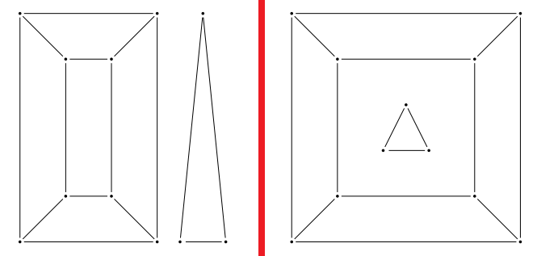
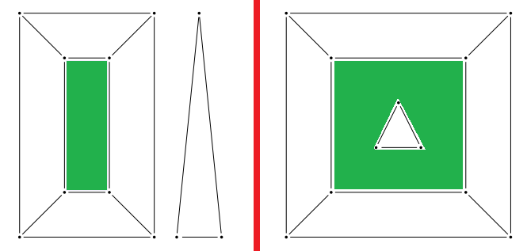

# Algoritmo de Kuratowski

## Definições

### Subdivisão de um grafo

Consiste em adicionar um número de vértices qualquer ao longo de arestas quaisquer do grafo.

### Grafos Isomorfos

Um grafo $g_1$ é `isomorfo` de um grafo $g_2$ se existe uma aplicação que coloca cada vértice do grafo $g_2$ no grafo $g_1$, **preservando** as arestas.

:::details[Exemplo]

Os dois grafos separados pela linha {red}(**vermelha**) são isomorfos

:::

### Grafos Equivalentes

Dois grafos $g_1$ e $g_2$ são equivalentes se são [isomorfos](#grafos-isomorfos) e preservam as fronteiras.

:::details[Exemplos]

Os grafos acima **são** isomorfos e equivalentes.

Os dois grafos separados pela linha {red}(**vermelha**) são isomorfos, mas como a região a {green}(**verde**) não é preservada (os vértices que forma a fronteira são diferentes nos $2$ casos), **não** é equivalente.

:::

### Representação Grafo Planar

Um grafo é planar, se e só se conseguirmos representá-lo numa superfície esférica, tal que os seus vértices não se instersetem.

As projetarmos o desenho num plano, ficamos com uma representação do grafo planar.  
Se rodarmos a esfera e projetarmos outra vez, teremos um desenho de um novo grafo planar, **equivalente** ao inicial.

:::tip[Importante]

Ao rodarmos a esfera sobre os eixos, conseguimos obter todas as representações do grafo planar.

:::

### Redução de um Grafo

Reduz-se um grafo, quando eliminamos um vértice de grau $2$. Se eliminarmos $v$, cujas arestas eram $(v_1,v)$ e $(v_2,v)$, essas arestas desaparecem e aparece um nova: $(v_1,v_2)$

:::details[Exemplo]

:::

### Grafo Homeomórfico

Dois grafos são `homeomórficos` se conseguimos aplicar a [redução](#reducao-de-um-grafo), até os grafos ficarem iguais.

## Teorema de Kuratowski

Um grafo é planar se e só se não contém um subgrafo [homeomórfico](#grafo-homeomprfico) ao grafo $k_5$ ou ao grafo $k_{3,3}$.

:::tip[Relembrar]

- $k_5 \rightarrow$ Grafo Completo de 5 vértices$
- $k_{3,3} \rightarrow$ Grafo bipartido com partições de dimensão $3:$

:::

:::details[Exemplos]

[Exemplo 1](https://drive.google.com/file/d/1poSHXrqoDA-_0-gyeMu-cokdHeIwTeBk/view?usp=sharing)  
[Exemplo 2](https://drive.google.com/file/d/1UfYr6tq04urwCTC1xkfjSzv6uVvaCYVu/view?usp=sharing)  
[Exemplo 3](https://drive.google.com/file/d/1DSOihYfY7MPpT8DB7sBZs_akzepYbG9b/view?usp=sharing)

Às vezes até pode ser planar  
[Exemplo 4](https://drive.google.com/file/d/15Xdd3BSg0KFU009kRTANIrF0W32JKtyi/view?usp=sharing)

:::tip[Dica]

Neste processo **nunca** adicionamos vértices, apenas removemos. Por isso, se os graus dos vértices forem $<4$, sabemos que nunca encontraremos um $k_5$, apenas $k_{3,3}$.  
Por outro lado, se os vértices tiverem grau $4$ podemos encontrar o $k_5$.

:::
